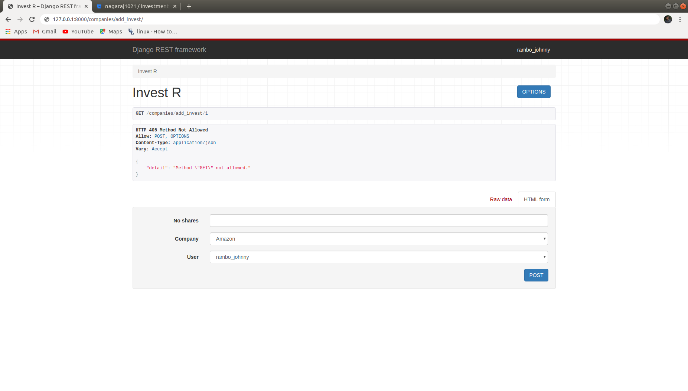

# Investment App

Investment App is an application to manage shares and stock information of users.

## Installation

Use the package manager [pip](https://pip.pypa.io/en/stable/) to install the app.

```bash
pip install virtualenv
virtualenv venv
pip install -r requirements.txt
```

## API

Do not use postman or Advanced Rest client for testing investment API. Please use the URL itself in the browser.




#### Register Api

```curl
http://127.0.0.1:8000/companies/register
```

###### Required params

```text
Example:
       first_name : Jeff 
       last_name : Applewhite
       email : jeff@yahoo.in
       password : &*%rt%$#
```

#### Login Api

```text
http://127.0.0.1:8000/companies/login
```

###### Required params

```curl
Example:
       email : jeff@yahoo.in
       password : &*%rt%$#
```

#### Get Company Info Api

```curl
http://127.0.0.1:8000/companies/get
```
#### Delete Company Info Api

```curl
http://127.0.0.1:8000/companies/delete/{id}
```

#### Add Company Info Api

```curl
http://127.0.0.1:8000/companies/add
```

###### Required params

```curl
Example:
       name : Alphabet inc
       location: Nebraska
       share_price: 478.98
```
#### Update Company Info Api

```curl
http://127.0.0.1:8000/companies/update/{id}
```

###### Required params
Any one of the below paraters will be fine, or all of them will be fine.
```curl
Example:
       name : Alphabet inc
       location: Nebraska
       share_price: 478.98
```

#### Get Investment Api

```curl
http://127.0.0.1:8000/companies/get_invest/{id}
```

#### Add Investment Info Api

```curl
http://127.0.0.1:8000/companies/add_invest
```

###### Required params

```curl
Example:
       no_shares : Alphabet inc
       company: Alphabet inc
       user: Jeff
```

#### Update Investment Info Api
Any one of the below paraters will suffice, else you can include all of them.
```curl
http://127.0.0.1:8000/companies/update_invest
```

###### Required params

```curl
Example:
       no_shares : Alphabet inc
       company: Alphabet inc
       user: Jeff
```
